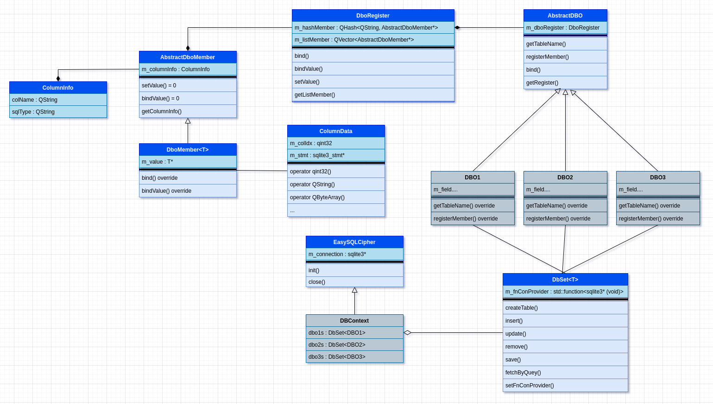

EasySQLCipher
=============

**EasySQLCipher** được xây dựng như một thư viện ORM. Với cách tiếp cận được lấy cảm hứng từ **Entity Framework** code first, Với hướng tiếp cận này các bảng dữ liệu được định nghĩa thông qua class DBO, các object tạo từ class DBO thuộc về một bảng và tương ứng dữ liệu với một record trong DB. Thể hiện của một sơ sở dữ liệu được gọi là một DBContext. Bên trong DBContext chứa các DbSet là thể hiện của các bảng. Thao tác với dự liệu trên bảng thực hiện thông qua DbSet.  

  

Với những ý tưởng trên, một mô hình các lớp được hình thành. Các lớp được sinh ra là để phục vụ nhu cầu cụ thể cho việc triển khai ý tưởng trên, cách mà mô hình được xây dựng như sau:
  
Đầu tiên để biến một class C++ thành một class DBO thì bằng cách nào đó class phải cung cấp được thông tin "các trường của class sẽ map với cột tương ứng nào trong bảng". Ý tưởng cho việc map là ở lớp DBO sẽ gọi một function để đăng ký thông tin, nó có thể có dạng như sau:  
```cpp
// bind(<column name>, <sql type>, <class field>)
bind("body", "text", &m_body);
```
với ý tưởng này, dựa vào "column name" đã đăng ký ta có thể tìm và gán trực tiếp giá trị vào object thông qua ref của "class field".  
"class field" sẽ có rất nhiều type, hướng tiếp cận thông thường cho trường hợp này là dùng overloading. Đây là lựa chọn không tồi, nhưng có một vấn đề cần giải quyết ở đây. Chúng ta cần một cái gì đó để chứa các thông tin mà DBO đã đăng ký, một danh sách hoặc một hash table chẳng hạn. C++ là một ngôn ngữ định kiểu mạnh, tất cả các phần tử trong hash hoặc list đều phải thuộc về cùng một kiểu dữ liệu. Vấn đề này có thể giải quyết một cách đơn giản bằng đa hình và ép kiểu tường minh. Một danh sách các members của class được đăng ký sẽ được lưu vào danh sách dạng **List\<AbstractMember\*>** khi hàm bind được gọi, một object của class dẫn xuất tương ứng kiểu dữ liệu được đăng ký sẽ được tạo và thêm vào list, nó có thể hoạt động như sau.
 ```cpp
class AbstractMember;

class MemberInt: public AbstractMember;
class MemberFloat: public AbstractMember;
...

void bind(QString colName, QString sqlType, int* field) {
    AbstractMember* member = new MemberInt(colName, sqlType, field);
    member->setMemberType("int");
    m_listMember.push_bask(member);
}

... 

void fetchData(...) {
    ...
    if(member->getMemberType() == "int") {
        MemberInt* memberInt = (MemberInt*)member;
        memberInt->setValue(valueInt);
    }
    ...
}
```
Nếu triển khai bằng cách này ta phải overloading khá nhiều hàm bind() và mở rộng không ít lớp dẫn xuất từ AbstractMember tương ứng cho từng kiểu dữ liệu.  
Giải pháp tốt nhất ở đây là kết hợp Inheritance và Template để vừa có được tính linh động vừa không phải tự implement quá nhiều. Giải pháp được trình bày như hình trên:
**DboMember\<T>** là lớp dẫn xuất từ AbtractDboMember. kiểu dữ liệu bên trong nó là m_value: T* sẽ được định kiểu khi một object DboMember\<T> khởi tạo.  
**DboRegister** chứa một hash member và một list member của AbtractDboMember*. Hình dáng của nó có thể được hình dung như sau.
```cpp
template<typename T>
class DboMember : public AbstractDboMember
{
    ...
public:
    DboMember(T* value, const QString& colName, const QString& sqlType) {
        m_value = value;
        m_columnInfo.sqlType = sqlType;
        m_columnInfo.colName = colName;
    }
    ...
private:
    T* m_value;
    ...
};

class DboRegister
{
    ...

    template<typename T>
    void bind(QString name, QString sqlType, T* memmber) {
        if(!m_hashMember.contains(name)) {
            auto dboMember = new DboMember(memmber, name, sqlType);
            m_hashMember.insert(name, dboMember);
            m_listMember.push_back(dboMember);
        }
    }
    ...
};
```

Đến đây có một vấn đề phát sinh, làm sao có thể gán giá trị sau khi truy vấn từ sqlcipher vào DboMember.? Với sqlcipher sau khi truy vấn thì dữ liệu được giữ trong sqlite3_stmt*, ta phải dùng các hàm tương ứng sqlite3_column_int, sqlite3_column_text,... để lấy dữ liệu đúng với kiểu dữ liệu. Tất nhiên ở đây có thể giải quyết bằng cách thủ công là dùng type check với std::is_same_v\<type1, type2\> và gán giá trị tương ứng với kiểu dữ liệu. Nhưng ta có một lựa chọn khác linh động và gọn gàng hơn là dùng một class có vai trò convert data từ sqlite3_stmt* sang T* bằng ép kiểu ngầm định và khởi tạo kiểu ngầm định:

```cpp
class ColumnData
{
public:
    ColumnData(const qint32& idx, sqlite3_stmt* stmt);

    operator qint32() const;
    operator QString() const;
    operator QByteArray() const;
    ...

private:
    qint32 m_colIdx;
    sqlite3_stmt* m_stmt;
};

template<typename T>
class DboMember : public AbstractDboMember
{
public:
    void setValue(ColumnData value) override {
        T forward = value;
        *m_value  = forward;
    }
};
```
Vấn đề cuối cùng cần giải quyết là bind data vào sqlite3_stmt để thực hiện truy vấn. Cách tốt nhất là overloading, khó có thể dùng template chổ này để rút gọn code, nên cứ đơn giản là overloading.
```cpp
bool stmtBindValue(sqlite3_stmt* stmt, qint32 idx, qint32 value)
{
    return sqlite3_bind_int(stmt, idx, value) == SQLITE_OK;
}

bool stmtBindValue(sqlite3_stmt* stmt, qint32 idx, const QString& value)
{
    auto valueData = value.toUtf8();
    return sqlite3_bind_text(stmt, idx, valueData, valueData.size(), SQLITE_TRANSIENT) == SQLITE_OK;
}

bool stmtBindValue(sqlite3_stmt* stmt, qint32 idx, const QByteArray& value)
{
    return sqlite3_bind_blob(stmt, idx, value, value.size(), SQLITE_TRANSIENT) == SQLITE_OK;
}
```
Như vậy đã có đầy đủ những class cần thiết để triển khai ý tưởng. Dưới đây là một đoạn code mẫu mô tả cách sử dụng **EasySQLCipher**.
```cpp
// file: user_dbo.h
class User : public AbstractDBO
{
public:
    User(){}

    QString getTableName() override {
        return "User";
    }

    void registerMember() override {
        bind("id", "integer", &m_id);
        bind("name", "text", &m_name);
        bind("data", "BLOB", &m_data);
    }

public:
    qint32  m_id;
    QString m_name;
    QByteArray m_data;
};

// file: message_dbo.h
class Message : public AbstractDBO
{
public:
    Message(){}

    QString getTableName() override {
        return "Message";
    }

    void registerMember() override {
        bind("id", "integer", &m_id);
        bind("body", "text", &m_body);
        bind("md5", "BLOB", &m_md5);
        bind("identity", "text", &m_identity);
    }

public:
    qint32      m_id;
    QString     m_body;
    QByteArray  m_md5;
    QString     m_identity;
};

// file: db.h
class TestDBContext : public EasySQLCipher
{
public:
    TestDBContext() {
        auto getConnection = [this](){
            return m_connection;
        };

        users.setFnConProvider(getConnection);
        messages.setFnConProvider(getConnection);
    }

    DbSet<User>    users;
    DbSet<Message> messages;
};

// main.cpp
int main(int argc, char *argv[])
{
    TestDBContext testDB;
    DBInitParam param;
    param.dbPath = "./test.db";
    param.openMode = SQLITE_OPEN_CREATE | SQLITE_OPEN_READWRITE | SQLITE_OPEN_FULLMUTEX;
    qDebug() << (qint32)testDB.init(param);

    testDB.users.createTable();
    testDB.messages.createTable();

    QVector<User> listUser;

    for(auto i = 0; i < 20; i++) {
        User user;
        user.m_id = 0;
        user.m_data = QByteArray::fromRawData("testData", 8);
        user.m_name = "testData_" + QString::number(i);

        listUser.push_back(user);
    }

    testDB.users.insert(listUser);

    testDB.close();

    return 0;
}
```