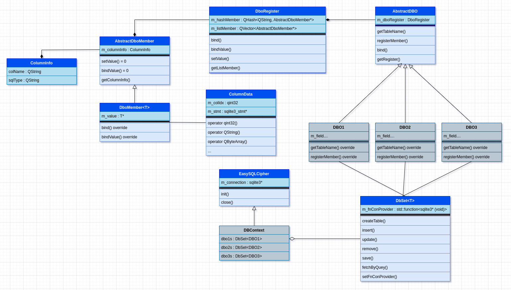

EasySQLCipher
=============

Chapter 1
---------  

**EasySQLCipher** được xây dựng như một thư viện ORM. Với cách tiếp cận được lấy cảm hứng từ **Entity Framework** code first, Với hướng tiếp cận này các bảng dữ liệu được định nghĩa thông qua class DBO, các object tạo từ class DBO thuộc về một bảng và tương ứng dữ liệu với một record trong DB. Thể hiện của một sơ sở dữ liệu được gọi là một DBContext. Bên trong DBContext chứa các DbSet là thể hiện của các bảng. Thao tác với dự liệu trên bảng thực hiện thông qua DbSet.  

  

Với những ý tưởng trên, một mô hình được hình thành. Mỗi lớp được sinh ra để phục vụ một nhu cầu cụ thể, cách mà mô hình được xây dựng như sau:
  
Đầu tiên để biến một class C++ thành một class DBO thì bằng cách nào đó class phải cung cấp được thông tin "các trường của class sẽ map với cột tương ứng nào trong bảng". Ý tưởng cho việc map là ở lớp DBO sẽ gọi một function để đăng ký thông tin, nó có thể có dạng như sau:  

```cpp
// bind(<column name>, <sql type>, <class field>)
bind("body", "text", &m_body);
```

với ý tưởng này, dựa vào "column name" đã đăng ký ta có thể tìm và gán trực tiếp giá trị vào object thông qua ref của "class field".  
"class field" sẽ có rất nhiều type, hướng tiếp cận thông thường cho trường hợp này là dùng overloading. Đây là lựa chọn không tồi, nhưng có một vấn đề cần giải quyết ở đây. Chúng ta cần một cái gì đó để chứa các thông tin mà DBO đã đăng ký, một danh sách hoặc một hash table chẳng hạn. C++ là một ngôn ngữ định kiểu mạnh, tất cả các phần tử trong hash hoặc list đều phải thuộc về cùng một kiểu dữ liệu. Vấn đề này có thể giải quyết một cách đơn giản bằng đa hình và ép kiểu tường minh. Một danh sách các members của class được đăng ký sẽ được lưu vào danh sách dạng **List\<AbstractMember\*>** khi hàm bind được gọi, một object của class dẫn xuất tương ứng kiểu dữ liệu được đăng ký sẽ được tạo và thêm vào list, nó có thể hoạt động như sau.

```cpp
class AbstractMember;

class MemberInt: public AbstractMember;
class MemberFloat: public AbstractMember;
...

void bind(QString colName, QString sqlType, int* field) {
    AbstractMember* member = new MemberInt(colName, sqlType, field);
    member->setMemberType("int");
    m_listMember.push_bask(member);
}

... 

void fetchData(...) {
    ...
    if(member->getMemberType() == "int") {
        MemberInt* memberInt = (MemberInt*)member;
        memberInt->setValue(valueInt);
    }
    ...
}
```

Nếu triển khai bằng cách này ta phải overloading khá nhiều hàm bind() và mở rộng không ít lớp dẫn xuất từ AbstractMember tương ứng cho từng kiểu dữ liệu.  
Giải pháp tốt nhất ở đây là kết hợp Inheritance và Template để vừa có được tính linh động vừa không phải tự implement quá nhiều. Giải pháp được trình bày như hình trên:
**DboMember\<T>** là lớp dẫn xuất từ AbtractDboMember. kiểu dữ liệu bên trong nó là m_value: T*sẽ được định kiểu khi một object DboMember\<T> khởi tạo.
**DboRegister** chứa một hash member và một list member của AbtractDboMember*. Hình dáng của nó có thể được hình dung như sau.

```cpp
template<typename T>
class DboMember : public AbstractDboMember
{
    ...
public:
    DboMember(T* value, const QString& colName, const QString& sqlType) {
        m_value = value;
        m_columnInfo.sqlType = sqlType;
        m_columnInfo.colName = colName;
    }
    ...
private:
    T* m_value;
    ...
};

class DboRegister
{
    ...

    template<typename T>
    void bind(QString name, QString sqlType, T* memmber) {
        if(!m_hashMember.contains(name)) {
            auto dboMember = new DboMember(memmber, name, sqlType);
            m_hashMember.insert(name, dboMember);
            m_listMember.push_back(dboMember);
        }
    }
    ...
};
```

**Chú Ý** DboRegister giữ reference đến vùng nhớ của member thuộc DBO. Nên khi copy DBO không được copy DboRegister, nếu cố tình copy thì sẽ xãy ra vấn đề obj này có register tham chiếu đến member của 1 obj khác. DboRegister bản thân đã implement copy contructor thành function rỗng để tránh điều này. Khi code hãy chú ý để tránh dùng sai mục đích của DboRegister. Bởi vì DboRegister không có copy contructor, nên DboRegister sẽ không giữ trạng thái, nếu cần DboRegister giữ trạng thái khi chuyển dữ liệu qua hãy dùng pointer hoặc reference.

Đến đây có một vấn đề phát sinh, làm sao có thể gán giá trị sau khi truy vấn từ sqlcipher vào DboMember.? Với sqlcipher sau khi truy vấn thì dữ liệu được giữ trong sqlite3_stmt*, ta phải dùng các hàm tương ứng sqlite3_column_int, sqlite3_column_text,... để lấy dữ liệu đúng với kiểu dữ liệu. Tất nhiên ở đây có thể giải quyết bằng cách thủ công là dùng type check với std::is_same_v\<type1, type2\> và gán giá trị tương ứng với kiểu dữ liệu. Nhưng ta có một lựa chọn khác linh động và gọn gàng hơn là dùng một class có vai trò convert data từ sqlite3_stmt* sang T* bằng ép kiểu ngầm định và khởi tạo kiểu ngầm định:

```cpp
class ColumnData
{
public:
    ColumnData(const qint32& idx, sqlite3_stmt* stmt);

    operator qint32() const;
    operator QString() const;
    operator QByteArray() const;
    ...

private:
    qint32 m_colIdx;
    sqlite3_stmt* m_stmt;
};

template<typename T>
class DboMember : public AbstractDboMember
{
public:
    void setValue(ColumnData value) override {
        T forward = value;
        *m_value  = forward;
    }
};
```

Vấn đề cuối cùng cần giải quyết là bind data vào sqlite3_stmt để thực hiện truy vấn. Cách tốt nhất là overloading, khó có thể dùng template chổ này để rút gọn code, nên cứ đơn giản là overloading.

```cpp
bool stmtBindValue(sqlite3_stmt* stmt, qint32 idx, qint32 value)
{
    return sqlite3_bind_int(stmt, idx, value) == SQLITE_OK;
}

bool stmtBindValue(sqlite3_stmt* stmt, qint32 idx, const QString& value)
{
    auto valueData = value.toUtf8();
    return sqlite3_bind_text(stmt, idx, valueData, valueData.size(), SQLITE_TRANSIENT) == SQLITE_OK;
}

bool stmtBindValue(sqlite3_stmt* stmt, qint32 idx, const QByteArray& value)
{
    return sqlite3_bind_blob(stmt, idx, value, value.size(), SQLITE_TRANSIENT) == SQLITE_OK;
}
```

Như vậy đã có đầy đủ những class cần thiết để triển khai ý tưởng. Dưới đây là một đoạn code mẫu mô tả cách sử dụng **EasySQLCipher**.

```cpp
// file: user_dbo.h
class User : public AbstractDBO
{
public:
    User(){}

    QString getTableName() override {
        return "User";
    }

    void registerMember() override {
        bind("id", "integer", &m_id);
        bind("name", "text", &m_name);
        bind("data", "BLOB", &m_data);
    }

public:
    qint32  m_id;
    QString m_name;
    QByteArray m_data;
};

// file: message_dbo.h
class Message : public AbstractDBO
{
public:
    Message(){}

    QString getTableName() override {
        return "Message";
    }

    void registerMember() override {
        bind("id", "integer", &m_id);
        bind("body", "text", &m_body);
        bind("md5", "BLOB", &m_md5);
        bind("identity", "text", &m_identity);
    }

public:
    qint32      m_id;
    QString     m_body;
    QByteArray  m_md5;
    QString     m_identity;
};

// file: db.h
class TestDBContext : public EasySQLCipher
{
public:
    TestDBContext() {
        auto getConnection = [this](){
            return m_connection;
        };

        users.setFnConProvider(getConnection);
        messages.setFnConProvider(getConnection);
    }

    DbSet<User>    users;
    DbSet<Message> messages;
};

// main.cpp
int main(int argc, char *argv[])
{
    TestDBContext testDB;
    DBInitParam param;
    param.dbPath = "./test.db";
    param.openMode = SQLITE_OPEN_CREATE | SQLITE_OPEN_READWRITE | SQLITE_OPEN_FULLMUTEX;
    qDebug() << (qint32)testDB.init(param);

    testDB.users.createTable();
    testDB.messages.createTable();

    QVector<User> listUser;

    for(auto i = 0; i < 20; i++) {
        User user;
        user.m_id = 0;
        user.m_data = QByteArray::fromRawData("testData", 8);
        user.m_name = "testData_" + QString::number(i);

        listUser.push_back(user);
    }

    testDB.users.insert(listUser);

    testDB.close();

    return 0;
}
```  

<br>
<hr>
<br>

Chapter 2
---------

Hiện tại với cách triển khai trên đã phục vụ được nhu cầu truy vấn cơ bản trên 1 bảng. Vấn đề tiếp theo cần phải giải quyết là truy vấn với dữ liệu trên nhiều bảng. Trong thực tế, việc liên kết dữ liệu giữa các bảng là nhu cầu cơ bản. Việc triển khai nó khá khó, nên ta chỉ hỗ trợ ở mức giới hạn, nhằm mục đích hỗ trợ truy vấn cơ bản trên nhiều bảng với thao tác tương đối đơn giản.  
Cú pháp truy vấn mong muốn sẽ có dạng như sau:  

```cpp
auto result = testDB.users
              .query("where #1.id = 1")                  
              .with<Message>("body")
              .with<Email>("address")
              .select("id, name");
auto firstUser = result.value.first();
LOG << firstUser.messages;
LOG << firstUser.emails;
```

Ý nghĩa của cú pháp trên là: từ bảng User, lấy user có id = 1. Sau đó lấy danh sách message và emails của user đó bên 2 bảng tương ứng. Select cột body trên bảng Message, address trên bảng Email, id và name trên bảng User.  
Ý tưởng để hiện thực hóa cú pháp truy vấn trên ta cần giải quyết một số vấn đề:
    + Bằng cách nào đó phải khai báo cho lớp truy vấn biết bảng A liên kết với bảng B trên column nào và sẽ map với trường nào của DBO.
    + Build câu truy vấn như thế nào để có thể lấy được dữ liệu liên kết.
    + Làm sao để map được dữ liệu từ các trường liên kết vào dữ liệu của DBO.  

Ta đi tìm cách giải quyết của từng vấn đề:

- Việc khai báo mối quan hệ giữa 2 bảng ta có thể làm bằng cách tương tự với register member. Nó có thể có dạng như sau:  

```cpp
// file: Email.cpp
void relation(const QString& relation, T* value, const QString& tableLeft) {
    ...
}
void registerMember() override {
    AbstractDBO::registerMember();
    ...
    relation("sip_id=sip_id", &m_user, getTableName());
}

User m_user;
```  

Hàm relation thuộc AbstractDBO sẽ giúp DBO định nghĩa mối quan hệ với một DBO khác. Như ví dụ ở trên, có pháp có ý nghĩa: DBO Email quan hệ với DBO User trên với liên kết "sip_id=sip_id". Tương tự với **DboMember**, lớp **DboRelationMember** sẽ giữ thông tin liên kết và đưa vào **QHash<QString, AbstractDboRelationMember\*> m_hashRelationMember;**.  

- Câu truy vấn được build dựa trên thông tin đã register, hiện tại **LEFT JOIN** là lựa chọn phù hợp nhất cho mục đích. Tên các bảng có thể  được biểu diễn bằng alias #1, #2, #3,.. theo thứ tự hàm **with**. Câu truy vấn sau khi build như sau:

```sql
SELECT User.id as User_id, User.name as User_name, Message.id as Message_id, Message.body as Message_body, Email.id as Email_id, Email.address as Email_address 
FROM User LEFT JOIN Message ON User.sip_id = Message.author 
LEFT JOIN Email ON User.sip_id = Email.sip_id 
where User.id = 1;
```

- Vấn đề cuối cùng khá phức tạp, việc lấy dữ liệu từ **sqlite3_stmt** để map vào dữ liệu đã đăng ký với DBO phải được giải quyết từng bước:  
  - Gom nhóm dữ liệu của mỗi row thành **QMultiMap<QString, ColumnData>** với key là tableName và value ColumnData là dữ liệu tương ứng với các cột trong kết quả truy vấn.
  - Sau khi đã có dữ liệu gom nhóm theo từng bảng, duyệt dữ liệu để map dữ liệu vào DBO. Cần định nghĩa thêm các hàm **DboRelationMember::setValue(QList\<ColumnData> values)**, **DboRegister::setValue(QList\<ColumnData> values)**, để phục vụ việc chuyển dữ liệu. Bản chất relation member cũng là một DBO, và nó được khai báo với DboRegister nên khi có được danh sách ColumnData tướng ứng với DBO thì vào tìm nó rồi chuyển danh sách đó qua DboRelationMember. Tham chiếu đến member của DBO được giữ tại đây, công việc còn lại là xác định member tham chiếu là obj hay danh sách obj để map phù hợp.
  - lặp lại các bước trên cho đến khi kết thúc.
  - DboRelationMember sẽ chứa **QSet\<qint32\> m_idsAdded** với khóa là id để xác định obj có tồn tại trong danh sách chưa.

<br>
<hr>
<br>

Chapter 3
---------

Dựa trên các hàm và cơ chế ở trên, xây dựng tiếp function update cho DbSet.

```cpp
DBCode update(T& obj, const QStringList& updateCols = {});
DBCode update(QVector<T>& listObj, const QStringList& updateCols = {});

auto r = testDB.users.update(user);
auto r = testDB.users.update(listUsers, {"name", "data"});
...
```  

Hình dạng của nó như trên, nguyên tắc update là trường id của tất cả các object đưa vào phải khác 0. Nếu id bằng 0 thì return và không làm gì cả. Khi một danh sách object truyền vào, hàm sẽ thực hiện update tuần tự từng object.  
Kết hợp hàm insert và hàm update ta thêm vào hàm save. Khi gọi hàm save, nếu id bằng 0 thì insert còn id khác 0 thì update.  

```cpp
DBCode save(T& obj) {
    qint32 id = obj.getId();
    if(id == 0) {
        return insert(obj);
    }
    
    return update(obj);
}
```

Đến đây chỉ còn lại hàm delete là hoàn thành các phương thức cơ bản của DbSet. Hàm delete không khó, chỉ cần lấy id của object và build query delete dựa trên id.  
Các hàm insert/update/delete/fetch/fetchWithRelation/save của DbSet được tạo ra để hỗ trợ các truy vấn cơ bản và thường xuyên được sử dụng, giảm bớt các thao tác lập đi lập lại khi sử dụng trực tiếp bằng interface của sqlite3. Về cơ bản ta đã có các hàm cần thiết để hỗ trợ các truy vấn phức tạp, nó chính là các hàm/class được xây dựng để triển khai DbSet. Việc cần là kết hợp các hàm lại để có interface dể dử dụng hơn.  
Ý tưởng là dùng callback để cho người dùng tự định nghĩa các quá trình bind value và step. Sử dụng các hàm đã có sẵn trong trong DBHelper để hỗ trợ. Cụ thể nó sẽ có hình dạng như sau.  

```cpp
struct ComplexQueryParams {
    QString query;
    std::function<bool(sqlite3_stmt*)> cbFuncBind;
    std::function<bool(sqlite3_stmt*)> cbFuncStep;
    std::function<void(DBCode)> cbFuncError;
    std::function<void()> cbFuncFinished;
    sqlite3* connection = nullptr;
};

void DBHelper::execQuery(const ComplexQueryParams& params);
```

Sử dụng như sau.

```cpp
DBHelper::ComplexQueryParams cplxParams;
cplxParams.query = "";
cplxParams.connection = testDB.getConnection();
cplxParams.cbFuncBind = [](sqlite3_stmt* stmt) -> bool {

};
cplxParams.cbFuncStep = [](sqlite3_stmt* stmt) -> bool {

};
cplxParams.cbFuncFinished = []() {

};
cplxParams.cbFuncError = [](DBCode code) {

};
```

Trong callback cbFuncBind có thể sử dụng 

```cpp
// bind value từ các member của 1 object.
obj.getRegister().bindValue("member_name", stmt);
obj.getRegister().bindValue("member_name", stmt, 1);

// bind value theo index của params.
DBHelper::stmtBindValue(stmt, 1, value);
```

Trong callback cbFuncStep có thể sử dụng

```cpp
// set value cho member của object thông qua register.
ColumnData data(2, stmt);
obj.getRegister().setValue("member_name", data);

// hoặc cast value từ columnData
qint32 val = data;
```

Ví dụ fetch tất cả các user có id > 19 có thể viết như sau.

```cpp
QVector<User> rsUsers;
DBHelper::ComplexQueryParams cplxParams;
cplxParams.query = "select * from User where id > :id;";
cplxParams.connection = testDB.getConnection();
cplxParams.cbFuncBind = [&](sqlite3_stmt* stmt) -> bool {
    if(!DBHelper::stmtBindValue(stmt, 1, 19)) {
        return false;
    }

    return true;
};
cplxParams.cbFuncStep = [&](sqlite3_stmt* stmt) -> bool {
    User user;
    user.registerMember();
    ColumnData idData(0, stmt);
    // có thể set value thông qua register với member name.
    user.getRegister().setValue("id", idData);

    ColumnData nameData(2, stmt);
    // hoặc dùng type cast.
    user.m_name = (QString)nameData;

    rsUsers.push_back(user);

    return true;
};
cplxParams.cbFuncFinished = [&]() {
    for(auto& user : rsUsers) {
        qDebug() << user.m_id;
        qDebug() << user.m_name;
    }
};
cplxParams.cbFuncError = [](DBCode code) {
    qDebug() << "error";
};

DBHelper::execQuery(cplxParams);
```

<br>
<hr>
<br>

Chapter 4
---------

Bất đồng bộ là công việc tiếp theo phải thực hiện. Bất đồng bộ không làm cho ứng dụng nhanh hơn, nhưng nó rất cần cho ứng dụng GUI. Các tác vụ truy vấn DB mất nhiều thời gian nếu chạy trên main thread thì ảnh hưởng rất lớn đến trải nghiệm. Bất đồng bộ giúp ta không vô tình block UI khi lỡ tay truy vấn DB quá nhiều.  
Qt6 mang lại một cơ chế bất đồng bộ rất hiện đại và linh động để sử dụng. Xây dựng các hàm bất đồng bộ bằng QtConcurrent của Qt6 rất dễ, không phải dùng futurewatcher sau đó connect để nhận kết quả. Qt6 mang đến concept hiện đại async().then().then().catch()... nó giúp logic code mạch lạc, dễ theo dõi hơn. Cụ thể tính năng bất đồng bộ sẽ được thực hiện trên DbSet như sau.

```cpp
auto asyncInsert(T& obj) {
    return QtConcurrent::run([obj, this] () mutable {
        DBCode rs = insert(obj);
        if(rs != DBCode::OK)
            throw EZException(rs);

        return obj;
    });
}
```

Chú ý, lambda sẽ được chạy trên thread pool nên phải copy obj chứ không thể dùng reference, mutable thêm vào là do insert yêu cầu reference để set id sau khi insert. Sử dụng như sau.  

```cpp
user.m_id = 0;
user.m_name = "kakakak";
user.m_data = "daaaaaa";
testDB.users.asyncInsert(user)
    .then(&app, [](User user){
        qDebug() << user.m_id;
        qDebug() << user.m_name;
    })
    .onFailed(&app, [](const EZException& e){
        qDebug() << "error : " << (int)e.code();
    });
```

EZ GAME!  

Chú ý: hàm select sẽ khác một chút. Thay vì capture this vào lambda thì bắt buộc phải capture value của this. Vì this ở đây là DBHelper::Query trả về từ hàm DbSet::query. Nên nếu capture this vào thì trước khi lambda chạy trong thread pool thì this đã bị huỷ. Copy value this vào sẽ giải quyết được trường hợp này.  

```cpp
auto asyncSelect(const QString& colSelect) const {
    return QtConcurrent::run([colSelect, t = *this] () {
        auto result = t.select(colSelect);
        if(result.retCode != DBCode::OK && result.retCode != DBCode::Empty)
            throw EZException(result.retCode);

        return result;
    });
}
```

